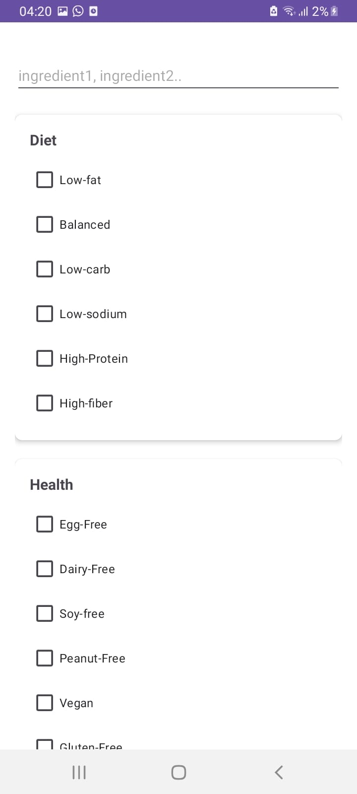
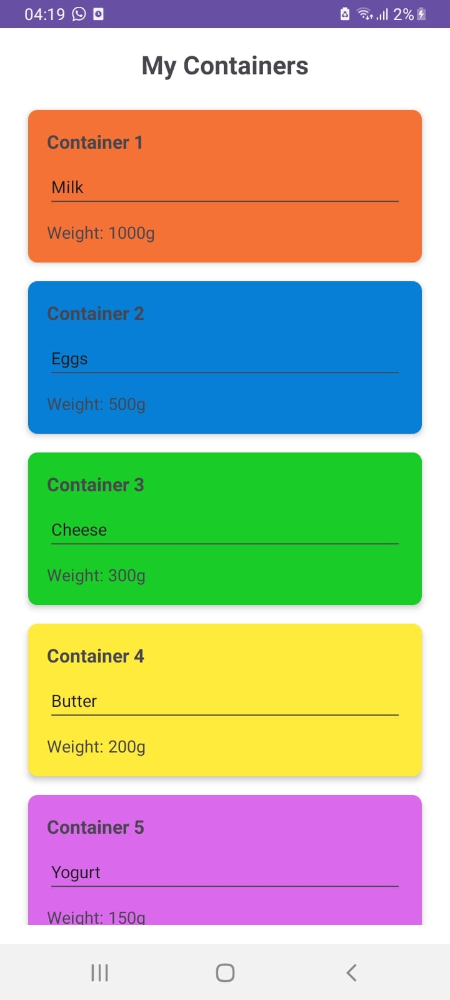

# 🧊 SmartFridge: Revolutionizing Food Management with IoT & AI

In response to the growing need to reduce food waste and improve stock management in households, traditional methods of food management have become insufficient. The integration of **Internet of Things (IoT)** technologies, **machine learning**, and **mobile applications** offers an optimal solution for users to efficiently monitor and manage their refrigerators. These advanced technologies enhance resource usage, convenience, and efficiency in food management.

The **SmartFridge** project automates processes such as real-time stock tracking, food freshness monitoring, and grocery and notification management. By leveraging a combination of techniques, including **IoT sensors**, **machine learning algorithms**, and **mobile development**, this prototype offers:

- 🥶 **Temperature & Humidity Monitoring**
- ⚠️ **Out-of-Stock Notifications**
- 🍳 **Recipe Suggestions via Integrated Chatbot**
  
---

## 🛠️ The Prototype

Our **IoT prototype** is equipped with multiple sensors to collect environmental data. We use a **DHT11 sensor** to measure temperature and humidity, along with a water level indicator to maintain optimal water levels. A solenoid valve is simulated using an LED, enabling remote control of irrigation.

### Data Flow:
- The **Arduino** reads data from sensors (humidity, temperature, gas, and weight) and sends it to the **Raspberry Pi** via a serial connection.
- The **Raspberry Pi** handles communication between the Arduino and Firebase, orchestrating sensor data flow and controlling actuators.
- Python scripts, using **Pyrebase** for Firebase interaction and **PySerial** for serial communication with the Arduino, manage data transmission.

---

## 📊 Data Flow with Node-RED

We use **Node-RED** to orchestrate the sensor data flow, making it easy to process and send data to Firebase in real-time. 

### Steps in Node-RED:
1. **Sensor Reading**: Nodes are configured to read data from Arduino-connected sensors.
2. **Data Processing**: Function nodes format and process the sensor data before transmission.
3. **Sending to Firebase**: Data is transferred to Firebase using HTTP or specific Firebase nodes.

---

## 🧠 Machine Learning Model

To predict food freshness, we use data on temperature, humidity, and gas levels collected inside the fridge. A supervised learning algorithm, **Random Forest**, is trained using sensor data as features and food freshness as the target. This model provides accurate, real-time predictions to help maintain food quality and reduce waste.

### Artificial Dataset Generation

Due to the lack of existing datasets with specific sensor data (CO₂, NH₃, NO₂, Methanol, Temperature, Humidity), we generated an artificial dataset to simulate realistic conditions for food freshness prediction.

---
## 🖥️ Application Interfaces

### Main Menu
The main menu allows users to navigate to key functionalities such as containers, locking the fridge, recipes, shopping list, profile, and logout.

---

### Dashboard
The dashboard displays essential information including humidity, temperature, food freshness, and locking status, along with a graph showing the stock of different foods.

---

### Caloric Needs Calculator
This interface enables users to calculate their caloric needs by entering personal information such as age, gender, weight, height, and activity level, providing an estimate of daily caloric requirements.

---

### Shopping List
The shopping list interface allows users to add, modify, and delete items from their shopping list, facilitating effective management of items to purchase for restocking the fridge.

---

### Recipe Generation
The recipe generation interface enables users to input available ingredients and select dietary preferences. The application then generates recipes based on this information, assisting users in meal planning.

---

### Refrigerator Lock
This interface allows users to lock or unlock their refrigerator to ensure the security of stored food. Users can control access directly from the application.

---

### Container Management
The container management interface displays the various foods stored in the refrigerator along with their respective weights, making it easy for users to track their food inventory.

---

### Notifications
Users receive notifications when the stock of food in containers is low (weight below 100) or when the refrigerator's state is no longer optimal (gas presence detected).

---

## 📚 Key Technologies Used
- **IoT Sensors**: DHT11, gas sensors, weight sensors
- **Microcontrollers**: Arduino, Raspberry Pi
- **Cloud Integration**: Firebase
- **Machine Learning**: Random Forest for predictive modeling
- **Data Flow Management**: Node-RED
- **Mobile App Development**: Android sdk for the developement

---

Feel free to explore the repository and contribute! 🚀
